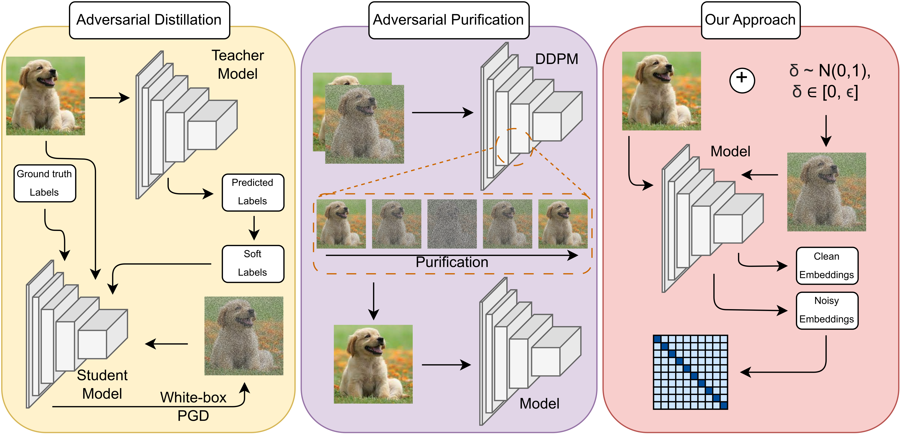

[](https://doi.org/10.5281/zenodo.17158447)

# LISArD: Learning Image Similarity to Defend Against Gray-box Adversarial Attacks

*Official Pytorch implementation of the [LISArD: Learning Image Similarity to Defend Against Gray-box Adversarial Attacks](https://www.arxiv.org/abs/2502.20562)*

Learning Image Similarity Adversa*r*ial Defense (LISArD) relates the similarity between clean and perturbed images by calculating the cross-correlation matrix between the embeddings of these images and using the loss to approximate this matrix to the identity while teaching the model to classify objects correctly. The goal of this approach is to reduce the effect of perturbations, motivating the model to recognize the clean and perturbed images as similar.


*Types of approaches commonly used to defend against adversarial attacks. The Teacher Model refers to a previously trained model, usually bigger than the Student Model, that aids the latter by providing soft labels. The DDPM refers to a Denoising Diffusion Probabilistic Model (a generative model) that uses noise and denoise to produce a "purified" image.*

### Gray-box Settings on CIFAR-10

Comparison of different training methods on **gray-box settings** on CIFAR-10. S, I, and L refer to ResNet trained from scratch, with ImageNet pretraining, and LISArD, respectively.

| Model              | Clean     | FGSM      | PGD       | AA        |
|:-------------------|:---------:|:---------:|:---------:|:---------:|
| ResNet<sub>S</sub> | 87.88     | 53.53     | 43.34     | 46.56     |
| ResNet<sub>I</sub> | **94.43** | 38.21     | 3.25      | 7.13      |
| ResNet<sub>L</sub> | 87.22     | **83.14** | **83.54** | **84.19** |

### State-of-the-art Comparison on CIFAR-10

Performance comparison with state-of-the-art approaches, with and without the inclusion of Adversarial Training (AT), on gray-box and white-box settings on CIFAR-10. Columns 2 to 5 refer to gray-box settings and 6 to 9 refer to white-box settings.


| Model              | Clean     | FGSM      | PGD       | AA        | Clean     | FGSM      | PGD       | AA        | t/ep (min)     |
|:-------------------|:---------:|:---------:|:---------:|:---------:|:---------:|:---------:|:---------:|:---------:|:--------------:|
| AdaAD              | 80.32     | 77.53     | 77.92     | 78.14     | 85.58     | 60.85     | 56.40     | 51.37     | 09:52          |
| AdaAD wo/ AT       | 88.89     | 70.71     | 63.83     | 67.06     | 88.89     | 37.93     | 1.39      | 0.11      | 09:46          |
| Δ                  | **+8.57** | *-6.82*   | *-14.09*  | *-11.08*  | *+3.31*   | **-22.92**| -55.01    | -51.26    | -              |
| PeerAiD            | 84.38     | 81.88     | 82.30     | 82.63     | 85.01     | 61.28     | 54.36     | 52.57     | 02:13          |
| PeerAiD wo/ AT     | 10.00     | 10.00     | 10.00     | 10.00     | 10.00     | 10.00     | 10.00     | 10.00     | 02:07          |
| Δ                  | -74.38    | -71.88    | -72.30    | -72.63    | -75.01    | -51.28    | *-44.36*  | *-42.57*  | -              |
| DGAD               | 87.50     | 84.91     | 85.47     | 85.83     | 85.75     | 62.28     | 58.05     | 52.34     | 09:54          |
| DGAD wo/ AT        | 41.19     | 36.97     | 36.69     | 37.10     | 37.32     | 3.77      | 0.08      | 0.00      | 09:48          |
| Δ                  | -46.33    | -47.94    | -48.78    | -48.73    | -48.43    | -58.51    | -57.97    | -52.34    | -              |
| LISArD             | 80.42     | 78.19     | 78.48     | 78.54     | 80.42     | 54.43     | 50.12     | 46.11     | 01:37          |
| LISArD wo/ AT      | 87.22     | 83.14     | 83.54     | 84.19     | 87.22     | 27.47     | 13.92     | 11.84     | 00:25          |
| Δ                  | *+6.80*   | **+4.95** | **+5.06** | **+5.65** | **+6.80** | *-26.96*  | **-36.20**| **-34.27**| -              |

### State-of-the-art Comparison on CIFAR-100

Performance comparison with state-of-the-art approaches, with and without the inclusion of Adversarial Training (AT), on gray-box and white-box settings on CIFAR-100. Columns 2 to 5 refer to gray-box settings and 6 to 9 refer to white-box settings.


| Model              | Clean     | FGSM      | PGD       | AA        | Clean     | FGSM      | PGD       | AA        | t/ep (min)     |
|:-------------------|:---------:|:---------:|:---------:|:---------:|:---------:|:---------:|:---------:|:---------:|:--------------:|
| AdaAD              | 61.82     | 58.91     | 58.83     | 59.55     | 62.19     | 35.33     | 32.52     | 26.74     | 09:53          |
| AdaAD wo/ AT       | 67.85     | 51.39     | 52.54     | 54.65     | 67.85     | 23.20     | 3.47      | 1.07      | 09:47          |
| Δ                  | *+6.03*   | *-7.52*   | *-6.29*   | *-4.90*   | *+5.66*   | **-12.13**| -29.05    | -25.67    | -              |
| PeerAiD            | 59.37     | 57.15     | 56.84     | 57.80     | 59.35     | 34.41     | 29.69     | 27.33     | 02:10          |
| PeerAiD wo/ AT     | 1.00      | 1.00      | 1.00      | 1.00      | 1.00      | 1.00      | 1.00      | 1.00      | 01:59          |
| Δ                  | -58.37    | -56.15    | -55.84    | -56.80    | -58.35    | -33.41    | *-28.69*  | -26.33    | -              |
| DGAD               | 63.26     | 60.77     | 60.07     | 61.33     | 63.24     | 36.09     | 33.68     | 27.66     | 09:55          |
| DGAD wo/ AT        | 25.71     | 22.45     | 22.35     | 22.71     | 10.79     | 4.46      | 4.20      | 2.20      | 09:49          |
| Δ                  | -37.55    | -38.32    | -37.72    | -38.62    | -52.45    | -31.63    | -29.48    | *-25.46*  | -              |
| LISArD             | 80.42     | 78.19     | 78.48     | 78.54     | 80.42     | 54.43     | 50.12     | 46.11     | 01:38          |
| LISArD wo/ AT      | 87.22     | 83.14     | 83.54     | 84.19     | 87.22     | 27.47     | 13.92     | 11.84     | 00:17          |
| Δ                  | **+18.01**| **+3.80** | **+3.43** | **+4.39** | **+18.01**| *-15.72*  | **-18.63**| **-15.42**| -              |


## Cite

```bibtex
@article{costa2025lisard,
  title={LISArD: Learning Image Similarity to Defend Against Gray-box Adversarial Attacks},
  author={Costa, Joana C and Roxo, Tiago and Proen{\c{c}}a, Hugo and In{\'a}cio, Pedro RM},
  journal={arXiv preprint arXiv:2502.20562},
  year={2025}
}
```
